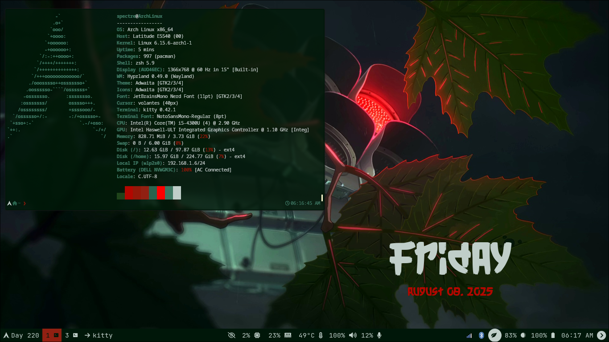
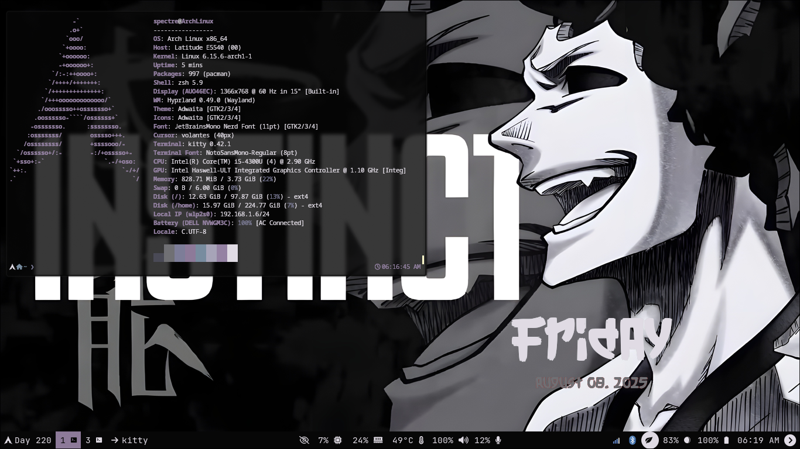
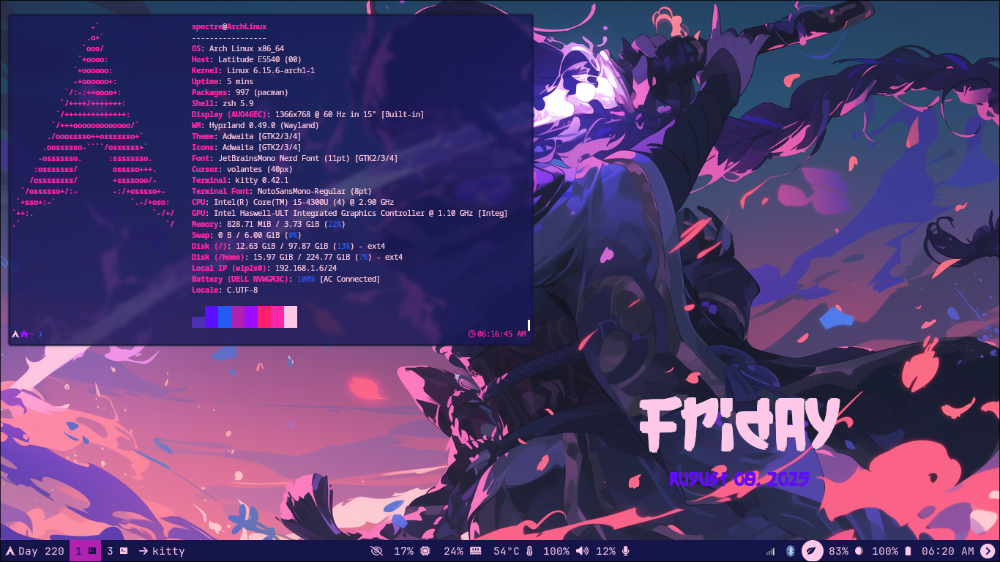
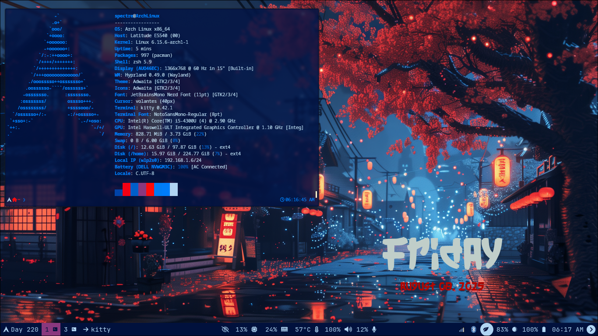
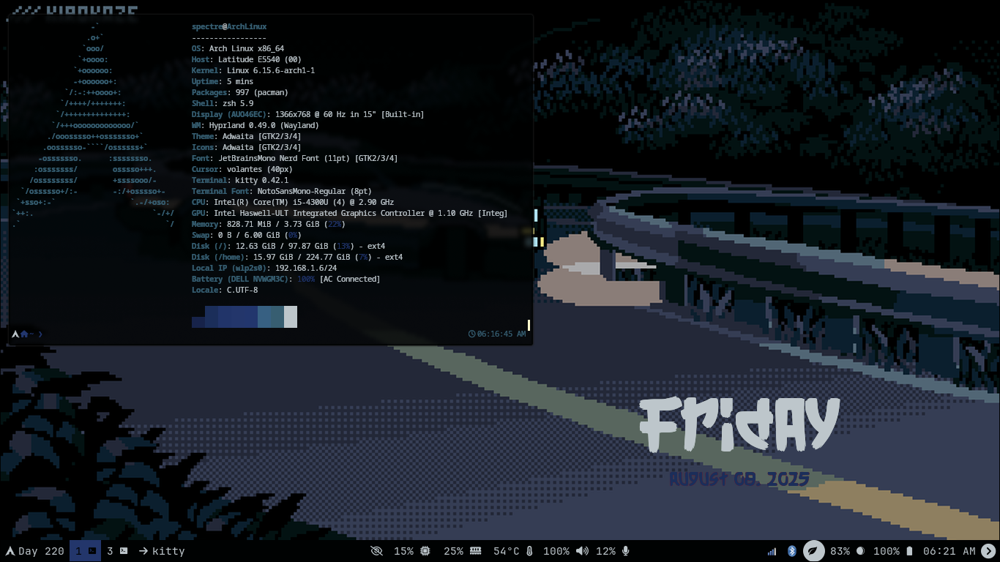
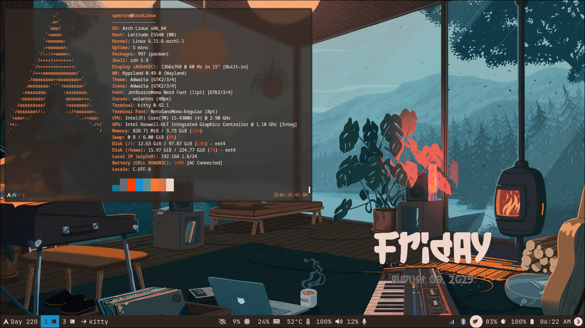
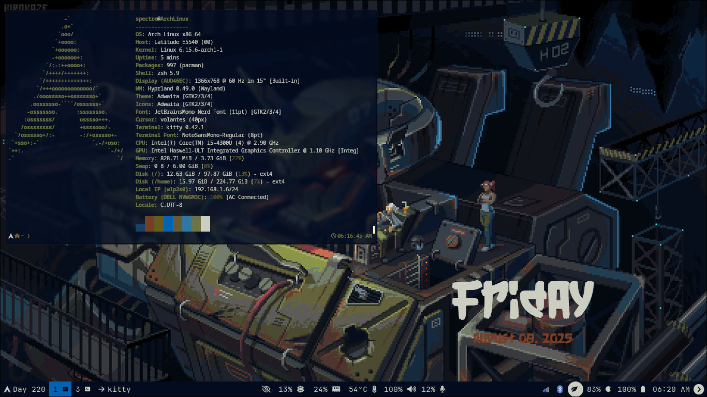

<div align="center" dir="rtl">
  <h1><pre>السلام عليكم ورحمة الله وبركاته</h1> </pre>
</div>

<div align="center" dir="rtl">
  <h1><pre>unfortrntly this repo is no longer Maintenanced</h1> </pre>
</div>

## I moved to niri with [niridots](https://github.com/0xsam1r/niridots)

# Dotfiles

Minimal. Modular. effictive.

A carefully crafted collection of dotfiles built for a fully customized and efficient Linux desktop using **Hyprland** and tools that prioritize speed, usability, and aesthetics.

---

# 🎨 Show Case









## 🧭 Overview

This repository is my personal system configuration — built around:

- ⚡ **Hyprland** as the main window manager
- 🎨 Dynamic theming using **Walrs**
- 🖥️ Custom terminal environment (Kitty + Zsh)
- 🧩 Modular layout using **GNU Stow**
- 🔐 Hardened script permissions and layout for secure usage, **comming soon!.**
- 🎯 Focus on both usability and scriptability

---

## 📂 Directory Structure

```
dotfiles/
|
├── LICENSE
│ 
├── README.md
│ 
├── assets
│ 
├── config
│   ├── gtk-3.0
│   ├── gtk-4.0
│   ├── hypr
│   ├── kitty
│   ├── walrs
│   ├── poweralertd
│   ├── qt5ct
│   ├── qt6ct
│   ├── rofi
│   ├── mako
│   ├── waybar
│   ├── wlogout
│   └── zsh
│ 
├── stow-dotfiles 
│ 
└── wallpapers
```

---

## ⚙️ Technologies

| Component     | Tool         |
| ------------- | ------------ |
| WM            | Hyprland     |
| Lock          | Hyprlock     |
| Idle Daemon   | Hypridle     |
| Bar           | Waybar       |
| Launcher      | Rofi         |
| Notifications | Mako         |
| Terminal      | Kitty + Zsh  |
| Theming       | Walrs        |
| Logout Menu   | Wlogout      |
| Power Alerts  | Poweralerted |

---

## 🚀 Setup Instructions

### 🧱 Clone the repo

```bash
git clone https://github.com/0xsam1r/dotfiles.git ~/dotfiles
cd ~/dotfiles
```

feel free to copy files manual or delete old configrations and run stow-dotfiles command
don't forget 

```bash
chmod +x stow-dotfiles
```

🎨 Dynamic Theming

Powered by Walrs, themes automatically adjust based on your selected wallpaper.

UI components like Waybar, Rofi, GTK, and QT sync to provide a cohesive experience.

    No bloat — only tools I use and improve regularly.

# 📄 License

Licensed under the MIT License.

Feel free to fork, adapt, and use for your own setup — credit is appreciated.

# 🧠 Final Thoughts

This repo is an evolving workspace. I’m always experimenting — breaking things, fixing them, and documenting my process.

If you're diving into Linux customization, tiling WMs, or secure scripting, feel free to explore or fork!

